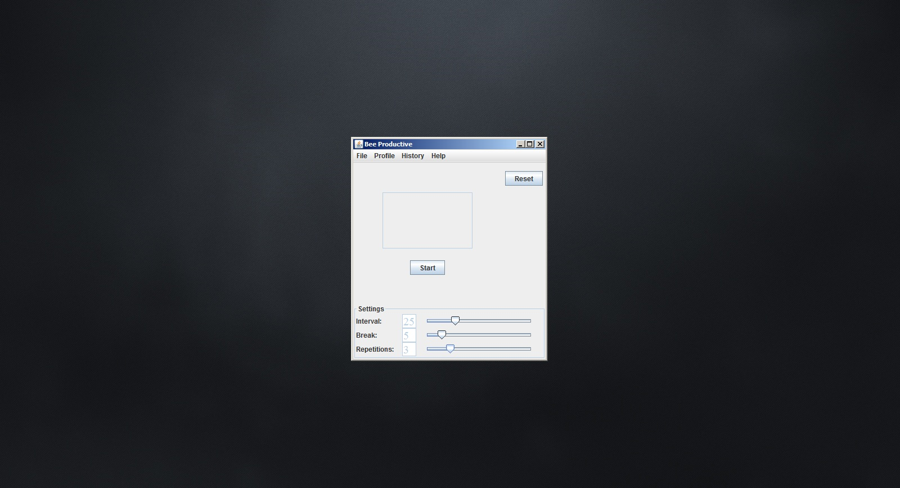
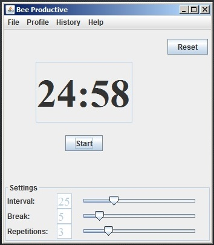
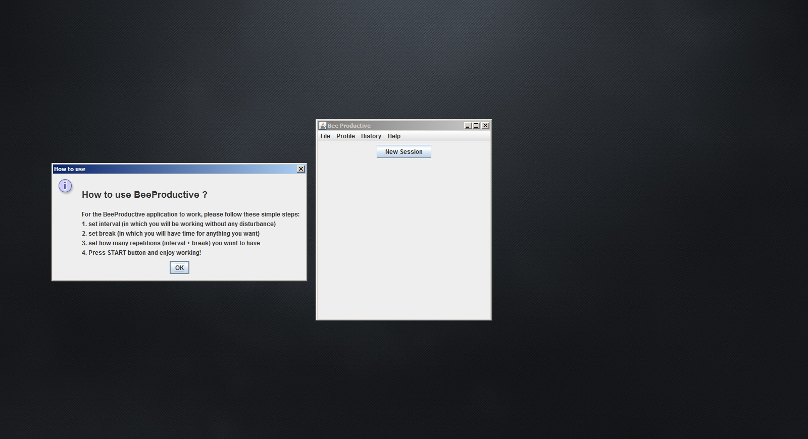
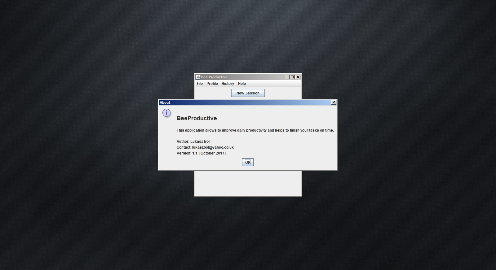

# BeeProductive
This project is all about stop procrastinating and improving a user's focus on tasks that they want to complete. It uses a well known Pomodoro Technique.
NOTE: The project is under construction.

The below are screenshots from the initial version of the program:

## 1. Application start

## 2. Input name for creating a new session (initial phase)

## 3. New session start

## 4. Setting: interval time, break time, repetitions

## 5. Start countdown

## 6. Help Menu --> How_to_use

## 7. Help Menu --> About

