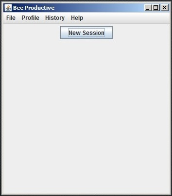
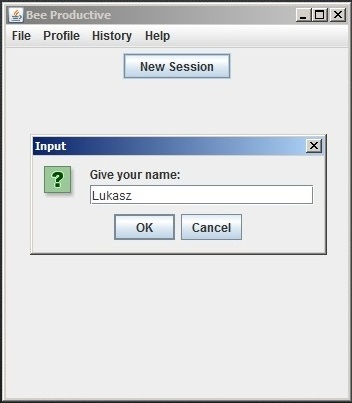
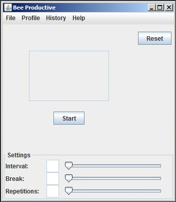
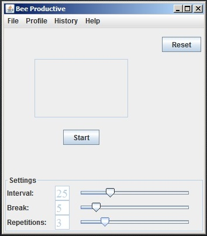
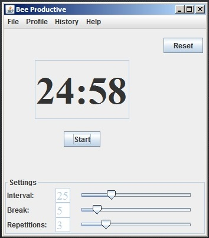
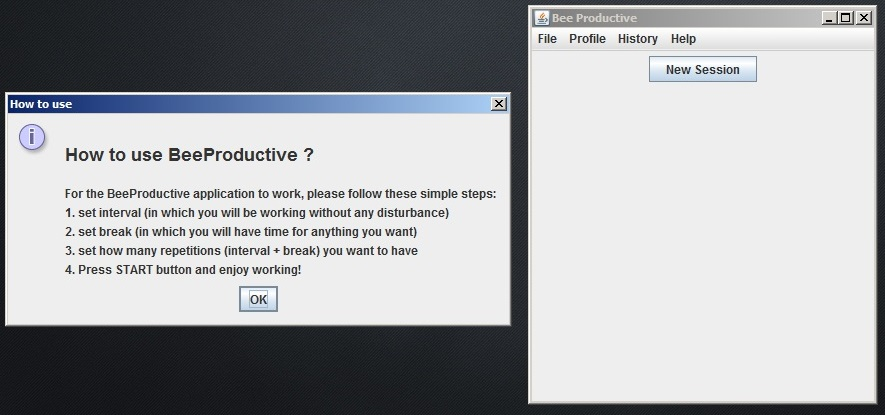
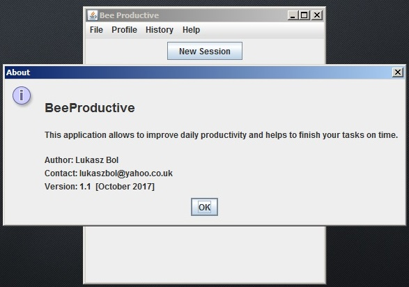

# BeeProductive

## Contents

1. Project Description
2. System Look
3. The Repository
4. Future Development
5. Help

## 1. Project Description  
This project is all about stop procrastinating and improving a user's focus on tasks that they want to complete. It uses a well known Pomodoro Technique.

NOTE: The project is under construction.

## 2. System look  
The below are screenshots from the initial version of the program:

## 2.1 Application start

## 2.2 Input name for creating a new session (initial phase)

## 2.3 New session start

## 2.4 Setting: interval time, break time, repetitions

## 2.5 Start countdown

## 2.6 Help Menu --> How_to_use

## 2.7 Help Menu --> About

## 3. The Repository  

## 3. Future Development 

## 3. Help  

